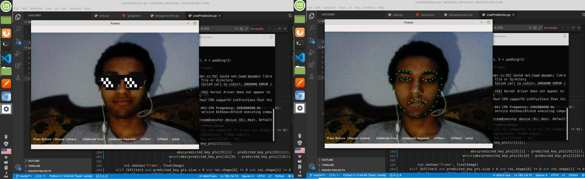

# Facial keypoint detection

In this project you will learn how to make a convolutional neural network to detect 68 keypoints on the human face.  
Just for fun, we'll use those points to add sunglasses to some faces.

At the end you will be able to do this

---

**NOTE**

If you just want to play around with this install the following packages:

- numpy
- matplotlib
- open-cv
- tensorflow
- pandas

then run  
`$ python app.py`

---

## The contents are:

### Documented notebooks going through the following

- preprocessing the data (**the way that works and the way that's right**)
- Creating and training a convolutional neural network(**on both ways of preprocessing**)
- using the model to simulate a snapchat filter

### Python files for:

- The definition of the generator class for data flow
- The definition of the filter class for effects
- The complete live project.

### And a bunch of images
